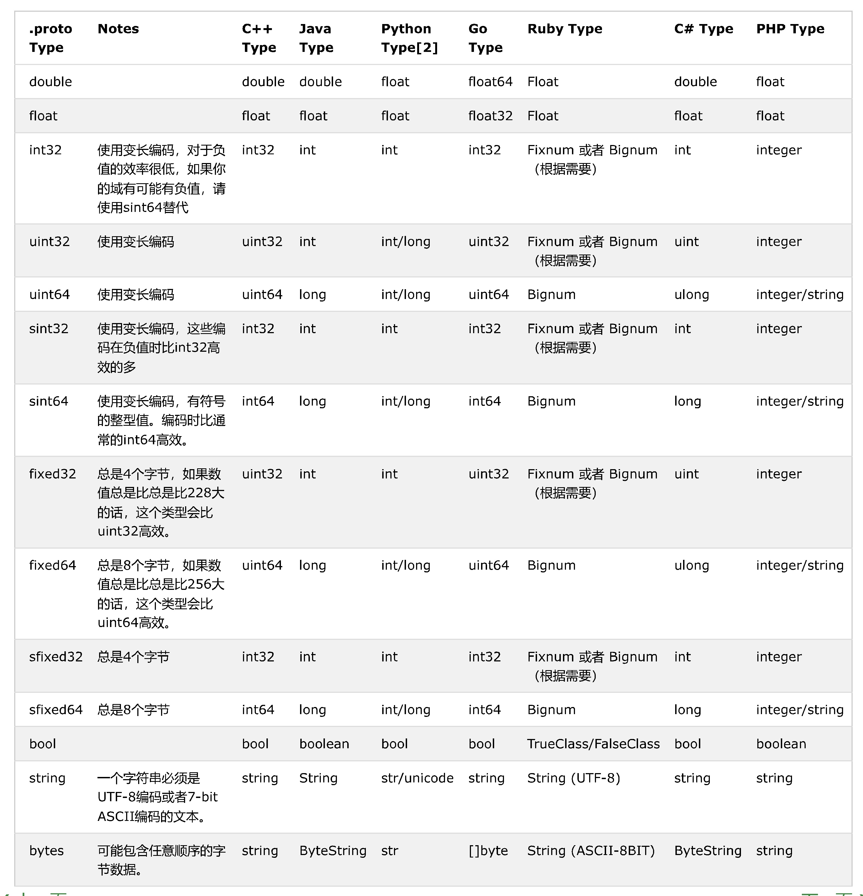

# gRPC for .NET

protocol buffers 是一种语言无关、平台无关、可扩展的序列化结构数据的方法，它可用于（数据）通信协议、数据存储等。

[gRPC](https://github.com/grpc/grpc)是一个高性能、通用的开源RPC框架，其由Google主要面向移动应用开发并基于HTTP/2协议标准而设计，基于ProtoBuf(Protocol Buffers)序列化协议开发，且支持众多开发语言。gRPC提供了一种简单的方法来精确地定义服务和为iOS、Android和后台支持服务自动生成可靠性很强的客户端功能库。客户端充分利用高级流和链接功能，从而有助于节省带宽、降低的TCP链接次数、节省CPU使用。

[gRPC](https://github.com/grpc/grpc)支持多种语言，并能够基于语言自动生成客户端和服务端功能库。目前，在GitHub上已 C++, Python, Ruby, Objective-C, PHP, C#)等语言。

## protobuf数据和编码

protobuf数据类型有四种 `Varint、64-bit、Length-delimited、32-bit`，`Start group` 和 `End group` 已废弃。




protobuf编码结构图，采用 `message -> field -> (Tag-[Length-]Value)`模式编码


## dotnet Framework开发

### 模型开发

* 安装依赖库
  * Install-Package Grpc
  * Install-Package Google.Protobuf
  * Install-Package Grpc.Tools
* 编写消息原型
* 编写pre-build编译脚本 build_rpc.bat，并配置

```proto
syntax = "proto3";

package greet; // greet 对应 namespace
 
// The greeting service definition.
service Greeter { // Greeter 对应 需实现的服务类
  // Sends a greeting
  rpc SayHello (HelloRequest) returns (HelloReply);
  // SayHello 对应 方法
  // HelloRequest 对应 请求参数类
  // HelloReply 对应 返回参数类
}

// 定义消息类，自动生成
// The request message containing the user's name.
message HelloRequest {
  string name = 1;
}

// The response message containing the greetings
message HelloReply {
  string message = 1;
}

```

### 服务端开发

* 引用模型库
* 实现服务端接口

```csharp
/// <summary>
/// 实现Greeter服务类
/// </summary>
public class GreeterImpl:Greeter.GreeterBase
{
    // 实现SayHello方法
    public override Task<HelloReply> SayHello(HelloRequest request, ServerCallContext context)
    {
        return Task.FromResult(new HelloReply { Message = "Hello " + request.Name });
    }
}

// 启动服务
Server server = new Server
{
    Services = { Greeter.BindService(new GreeterImpl()) },
    Ports = { new ServerPort("localhost", Port, ServerCredentials.Insecure) }
};
server.Start();

// dot sth

//elegance quit
server.ShutdownAsync().Wait();

```

### 客户端调用

* 引用模型库
* 调用

```csharp
Channel channel = new Channel("127.0.0.1:36", ChannelCredentials.Insecure);
var client = new Greeter.GreeterClient(channel);
var reply = client.SayHello(new HelloRequest { Name = "Su" });

// dot sth

//elegance quit
channel.ShutdownAsync().Wait();

```

## 后记

XML、JSON、ProtoBuf 三者比较

* XML、JSON、ProtoBuf 都具有数据结构化和数据序列化的能力
* XML、JSON 更注重数据结构化，关注人类可读性和语义表达能力。ProtoBuf 更注重数据序列化，关注效率、空间、速度，人类可读性差，语义表达能力不足（为保证极致的效率，会舍弃一部分元信息）
* ProtoBuf 的应用场景更为明确，XML、JSON 的应用场景更为丰富。


参考 [gRPC C#学习](https://www.cnblogs.com/linezero/p/grpc.html)

[ProtoBuf介绍](https://www.jianshu.com/p/a24c88c0526a)

[gRPC](https://github.com/grpc/grpc)是基于c的wrapper库，开发者已全面转向net原生的[grpc-dotnet](https://github.com/grpc/grpc-dotnet)开发。

[Google's protocol-buffers](https://developers.google.com/protocol-buffers/docs/overview)
[Microsoft's gRPC概叙](https://docs.microsoft.com/zh-cn/dotnet/architecture/grpc-for-wcf-developers/grpc-overview)
